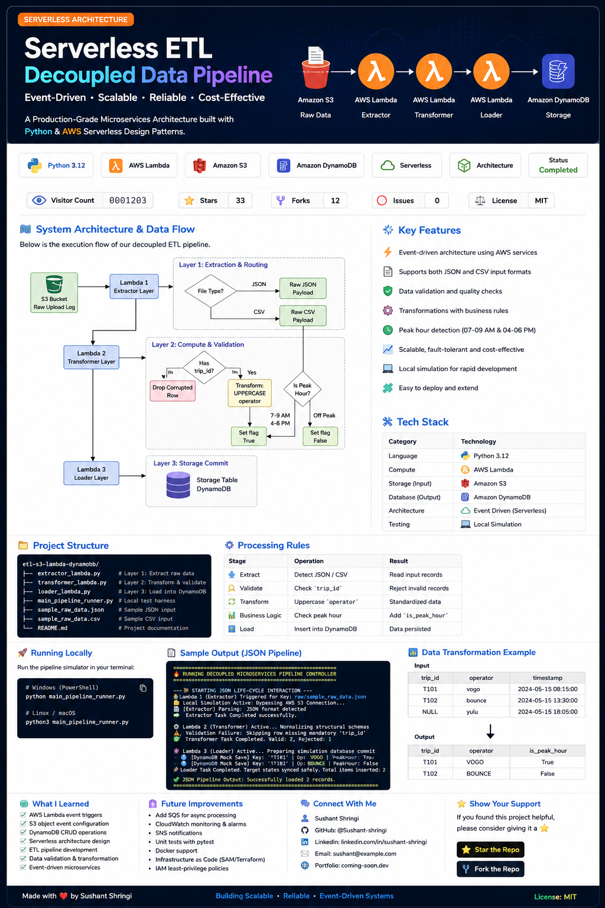
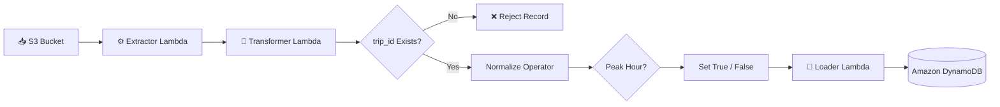

# etl-s3-lambda-dynamodb
<p align="center">
  
</p>

<h1 align="center">⚡ Serverless ETL Data Pipeline</h1>

<p align="center">
A Production-Grade Event-Driven ETL Pipeline built using AWS Serverless Services and Python.
</p>

<p align="center">


</p>

<p align="center">


</p>


# ⚡ Serverless ETL Data Pipeline

<p align="center">
  <b>A Production-Grade Event-Driven ETL Pipeline built using AWS Serverless Services and Python.</b>
  <br><br>


</p>

---

# 📌 Overview

This project demonstrates a **production-inspired serverless ETL architecture** built on AWS.

Whenever a JSON or CSV file is uploaded, the pipeline automatically:

- 📥 Extracts incoming data
- 🔍 Validates records
- 🔄 Transforms the dataset
- 📊 Computes business rules
- 💾 Stores processed data in DynamoDB

The project follows an **event-driven microservices architecture**, where every Lambda function has a single responsibility, making the system scalable, maintainable, and fault tolerant.

P

---

# ✨ Features

- ✅ Event-Driven Architecture
- ✅ AWS Lambda Functions
- ✅ Amazon S3 Trigger
- ✅ Data Validation
- ✅ Data Transformation
- ✅ Peak Hour Detection
- ✅ DynamoDB Storage
- ✅ Modular Design
- ✅ Local Pipeline Simulation
- ✅ Easily Deployable to AWS

---

# 🏗️ System Architecture



---

# ⚙️ Technology Stack

| Category | Technology |
|-----------|------------|
| Language | Python 3.12 |
| Compute | AWS Lambda |
| Storage | Amazon S3 |
| Database | Amazon DynamoDB |
| Architecture | Event Driven |
| Pattern | Serverless ETL |
| Testing | Local Simulation |

---

# 🎯 ETL Workflow

```text
Upload File

↓

S3 Bucket

↓

Lambda 1
(Extraction)

↓

Lambda 2
(Transformation)

↓

Validation

↓

Business Rules

↓

Lambda 3
(Loader)

↓

DynamoDB
```
# 📂 Project Structure

```text
etl-s3-lambda-dynamodb/
│
├── 📄 extractor_lambda.py        # Extracts raw data from incoming files
├── 📄 transformer_lambda.py      # Cleans and transforms records
├── 📄 loader_lambda.py           # Loads processed data into DynamoDB
├── 📄 main_pipeline_runner.py    # Local pipeline simulator
├── 📄 sample_raw_data.json       # Sample input file
├── 📄 sample_raw_data.csv        # Sample CSV input
└── 📄 README.md
```

---

# ⚙️ Pipeline Processing Rules

| Stage | Operation | Result |
|--------|-----------|--------|
| 📥 Extract | Detect JSON / CSV | Read input records |
| 🔍 Validate | Check `trip_id` | Reject invalid records |
| 🔄 Transform | Convert operator names to uppercase | Standardized data |
| 📊 Business Logic | Detect Peak Hour | `is_peak_hour = True/False` |
| 💾 Load | Insert into DynamoDB | Process completed |

---

# 🚀 Running the Project

### Clone Repository

```bash
git clone https://github.com/Sushant-shringi/etl-s3-lambda-dynamodb.git

cd etl-s3-lambda-dynamodb
```

---

### Run Locally

```bash
python main_pipeline_runner.py
```

---

# 📋 Expected Output

```text
==========================================================
🔥 RUNNING SERVERLESS ETL PIPELINE
==========================================================

📥 Extractor Lambda Triggered
✔ JSON file detected

⚙ Transformer Lambda Running
✔ 2 valid records
✘ 1 invalid record skipped

💾 Loader Lambda Running
✔ Record T101 inserted
✔ Record T102 inserted

Pipeline Completed Successfully
==========================================================
```

---

# 📊 Sample Data Transformation

### Input

| trip_id | operator | timestamp |
|----------|----------|-----------|
| T101 | vogo | 08:15 |
| T102 | bounce | 13:30 |
| NULL | yulu | 18:05 |

↓

### Output

| trip_id | operator | is_peak_hour |
|----------|----------|--------------|
| T101 | VOGO | ✅ True |
| T102 | BOUNCE | ❌ False |

---

# 🧪 Local Simulation

Instead of deploying every change to AWS, this project supports local execution.

Benefits:

- ⚡ Faster development
- 🐞 Easy debugging
- 💰 No AWS execution cost
- 🔄 Test pipeline logic before deployment


# 🎯 Key Highlights

- 🚀 Production-inspired Serverless ETL Architecture
- ⚡ Event-Driven Workflow using AWS Lambda
- 📥 Automatic Processing of JSON & CSV Files
- 🔍 Data Validation & Quality Checks
- 🔄 Data Standardization & Transformation
- 📊 Peak Hour Business Rule Computation
- 💾 DynamoDB Integration
- 🧪 Local Simulation for Development & Testing
- 📦 Modular & Scalable Project Structure

---

# 🧠 What I Learned

This project helped me gain practical experience with:

- AWS Lambda Event Triggers
- Amazon S3 Object Events
- Amazon DynamoDB Operations
- Serverless Architecture Design
- ETL Pipeline Development
- Data Validation & Transformation
- Event-Driven Systems
- Python Modular Programming
- Building Cloud-Native Applications

---

# 🔮 Future Improvements

- ⏳ Add SQS for asynchronous processing
- 📈 Integrate CloudWatch Monitoring
- 🔔 Add SNS notifications
- 🧪 Unit Tests with pytest
- 🐳 Docker support for local development
- ☁️ Infrastructure as Code using AWS SAM or Terraform
- 🔐 IAM least-privilege policies
- 📊 Monitoring dashboard

---


<p align="center">

</p>

---

# 📈 Architecture Principles

| Principle | Implementation |
|-----------|----------------|
| Single Responsibility | One Lambda per stage |
| Loose Coupling | Event-driven workflow |
| Scalability | Serverless compute |
| Fault Isolation | Independent processing layers |
| Maintainability | Modular project structure |

---

# 📬 Contact

If you have any suggestions or feedback, feel free to connect.

- 💼 GitHub: https://github.com/Sushant-shringi
- 📧 Email: *Add your email here*
- 💬 LinkedIn: *Add your LinkedIn profile*

---

# ⭐ Support

If you found this project useful,

⭐ Star this repository

🍴 Fork it

🛠️ Build something awesome from it

---

# 👨‍💻 Author

**Sushant Shringi**

Cloud & Data Engineering Enthusiast

Python • AWS • SQL • ETL • Data Engineering

---

<p align="center">

Made with ❤️ using Python & AWS Serverless

</p>
