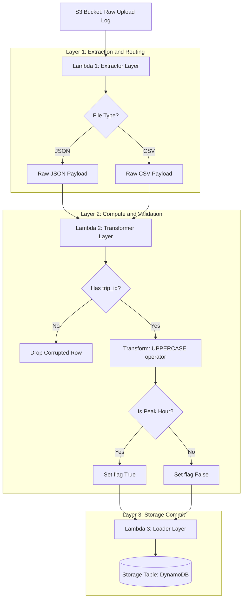

# etl-s3-lambda-dynamodb
# ⚡ Serverless ETL: Decoupled Data Pipeline
> A Production-Grade Microservices Architecture built with Python & AWS Serverless Design Patterns.


---

## 🗺️ System Architecture & Data Flow

Below is the execution flowchart showing how data moves asynchronously through our decoupled layers without causing a single point of failure.


## 📂 Project Directory Structure

```text
etl-s3-lambda-dynamodb/
├── 📥 extractor_lambda.py
├── ⚙️ transformer_lambda.py
├── 💾 loader_lambda.py
├── 🎮 main_pipeline_runner.py
└── 📝 README.md
```
🛠️ Operational Specs & Transformation LawsMetric PillarOperation Execution RuleOutput Result StandardData Quality FilterCheck if explicit trip_id exists in the record.Drops missing rows automatically without breaking pipeline state.Schema NormalizationConvert string sequences under the operator column.vogo ➡️ VOGO, bounce ➡️ BOUNCE, yulu ➡️ YULUBI Flag ComputationVerify timestamp boundary cycles against rush hours.Assigns an is_peak_hour: True flag during 07-09 & 16-18 intervals.🚀 Execution Simulation (Local Diagnostics)We utilize a centralized controller to evaluate decoupled responses without wasting live cloud network computing time. Run this diagnostic test locally inside your terminal:PowerShellpython main_pipeline_runner.py
Flawless Live Logs Preview:JSON==========================================================
 🔥 RUNNING DECOUPLED MICROSERVICES PIPELINE CONTROLLER   
==========================================================

--- 🏁 STARTING JSON LIFE-CYCLE INTERACTION ---
📥 Lambda 1 (Extractor) Triggered for Key: raw/sample_raw_data.json
📂 Local Simulation Active: Bypassing AWS S3 Connection...
📋 [Extractor] Parsing: JSON format detected
➡️ Extractor Task Completed successfully.

⚙️ Lambda 2 (Transformer) Active... Normalizing structural schemas
  ⚠️ Validation Failure: Skipping row missing mandatory 'trip_id'
✅ Transformer Task Completed. Valid: 2, Rejected: 1

💾 Lambda 3 (Loader) Active... Preparing simulation database commit
  🔬 [DynamoDB Mock Save] Key: 'T101' | Op: VOGO | PeakHour: True
  🔬 [DynamoDB Mock Save] Key: 'T102' | Op: BOUNCE | PeakHour: False
🚀 Loader Task Completed. Target states synced safely. Total items inserted: 2

JSON Pipeline Output: Successfully loaded 2 records.
==========================================================
